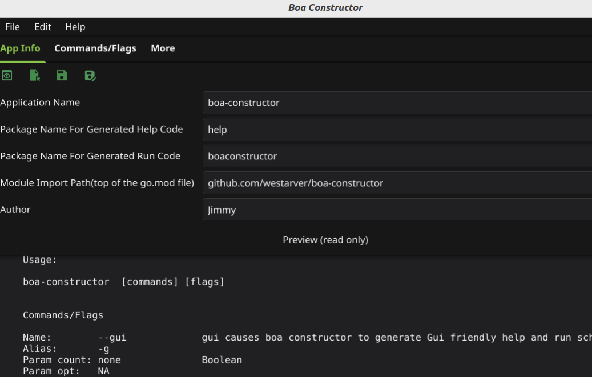
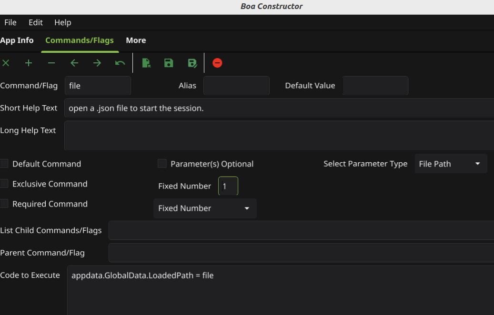

# Boa Constructor 

#####    Repositories
[boa library](https://github.com/westarver/boa)<br>
[boa-constructor GUI app](https://github.com/westarver/boa-constructor)

#####   Acknowlegements
[fyne GUI toolkit for go](https://fyne.io)

#####  License
The Boa products are free for anyone to use in any way.<br>
[unlicense](https://choosealicense.com/licenses/unlicense/)

### Getting Boa-Constructor:

```bash
    # get boa library
    $ go get https://github.com/westarver/boa

    # get GUI app
    $ go install https://github.com/westarver/boa-constructor
```

##	Invoking Boa Constructor from the command line

###	boa-constructor  [commands] [flags]

###	Commands Flags:

#### --gui             *--gui causes boa constructor to generate Gui friendly help and run schemes.*
-	Alias:       -g
-	Parameter count: none              Boolean
-	Parameter optional:   NA
-	Exclusive command:   No
-	Default command:     No
-	Required command:    No<br>
###### See more on gui  
[Long Description of --gui](#long-description-of-gui)<br>

---
#### --mdhelp          *--mdhelp is a boolean command to cause help generation to generate markdown content.*
-	Alias:       -m
-	Parameter count: none              Boolean
-	Parameter optional:   NA
-	Exclusive command:   No
-	Default command:     No
-	Required command:    No<br>
###### See more on mdhelp 
[Long Description of --mdhelp](#long-description-of-mdhelp)<br>

---
####    file             *file passes a path to open a .json file to start the session.*
-   Alias:   No Alias
-	Parameter count: 1            File Path
-	Parameter optional:  No
-	Exclusive command:   No
-	Default command:     No
-	Required command:    No<br>
###### See more on file 
[Long Description of file](#long-description-of-file) <br> 

---
The usual construction of merging multiple aliases to create a composite command is fully supported. That is -gm resolves to --gui and --mdhelp. Only the final alias can have required parameters.

### Using Boa-Constructor
Boa-constructor is the GUI front end to the Boa library.  Even though Boa does the same basic job as that other snake :), we are not a copycat of Cobra, nor do we claim to be as comprehensive.  The joke is that Boa stands for Boa's Only Acting. Boa takes a different approach. Using BC is simpler, quicker, and easier with less code to write at the cost of being somewhat less capable.  Boa is capable of almost any 'normal' cli design you want to create, but could present limitations at the high end of complexity.

A cli tool or a desktop Gui progam can have a command line interface. Boa Constructor itself has a cli, as one can see from the above section of this document titled **Invoking Boa-Constructor from the command line**. But normally a cli application will have a bigger, more involved cli than a GUI.  

Boa supports nesting sub-commands within commands or sub-commands, that can be several levels deep. In theory there are no limits to the level of nesting, but in practice anything more than three or four levels will be unwieldy for the end user. This capability can support a fairly large and complicated cli. 

The developer uses the GUI to define the command line interface for their app. The process is very fast and simple. The screenshot of the first tab, seen below, shows the basic application data layout. Note the preview window which gives you a look at the basic help text generated by the commands. All of the functionality of BC can be executed via a menu, a toolbar button, or a keyboard shortcut. The keyboard shortcuts are shown in the label of the menu items they shortcut for or the popup label shown when hovering over a toolbar button with a shortcut, but here is a list of them:

##### Keyboard Shortcuts
| Function               | Key Combo                  |
|------------------------|----------------------------|
| Open                   | ctrl/command + O           |
| Save                   | ctrl/command + S           |
| Save As                | ctrl/command + shift + S   |
| Generate Code          | ctrl/command + G           |
| Quit                   | ctrl/command + Q           |
| Refresh Preview        | ctrl/command + R           |
| Copy Json to Clipboard | ctrl/command + L           |
| Store Command          | ctrl/command + T           |
| Next Command           | ctrl/command + →           |
| Previous Command       | ctrl/command + ←           |



The next screenshot shows the Command Tab. All of the data needed to define a command is entered here.  All a command really needs to be defined is a name.  Other properties are available but not required. All of the entries on the Command Tab are easy to understand. Unless a command or flag is a simple boolean, meaning if it's there it's true, a type and count of the allowed or required parameters must be entered. A command can take no parameters, a fixed number of parameters, or a variable number. It can have a default parameter or list of parameters in which case the parameter is optional.



### Code generation
Boa Constructor can generate go source code to start the program (main.go), get and evaluate the arguments passed in (runcli.go), set up and operate a complete help system (help.go)for a cli app or a GUI app, and partially fill in a README.md template. 

Unless the developer enters some code to execute when a command is recognized, BC will generate a nop stub that will print a "not implemented" message. But at least there will be no compile errors. If the developer writes an assignment or function call in the GUI to be copied to the generated source, some editing may be required as BC may not have access to the proper import path or other necessary data.

### Running the generated code
Where possible basic validation is done by the Boa library during parsing to catch command line input errors. There are a number of data types that can be validated during the parsing process.
- File Path
- Integer
- Float
- Time
- Time Duration
- Date
- Phone Number
- Email Address
- Ip Address
- URL

Developers will have to do their own validation for strings and other types parsed as strings as that data could be almost anything.

The Boa library decodes the json data  generated by the GUI and matches the command line arguments passed to your app at the current invocation.

The JSON data generated by boa-constructor will be passed to the Boa
library function boa.FromJSON([]byte, []string) as below:
```go
    // this code is generated in the runcli.go file
    import "github.com/westarver/boa"

    func Runcli(w io.Writer) int {
        cli := boa.FromJSON(jsonBytes(), os.Args)
        if cli == nil {
            fmt.Fprintf(w, "%s\n", "unable to obtain cli object from Boa")
            return -1
        }
    // cli implementation ...
``` 
Call from your app and your app will receive a data structure (cli in the above example)containing the command line args with parameters etc. 

A couple of more things of note:<br>
Any command that can accept a variable number of, or optional parameters (one or more / zero or any number)
must have its parameter list end with the sentinel string -- (dash dash), unless nothing else follows. 

A parameter with spaces must be quoted.  John Doe would be seen as two strings, "John Doe" will be parsed correctly.
A few examples are in order:
```bash
   # cmd takes variable number of parameters so use -- to end list
   $ my-app cmd 1st 2nd -- -n=1

   # no dashes required at the end of line
   $ my-app -n 1 cmd 1st 2nd  

   # also note the = sign is optional -n 1 == -n=1
   # no spaces allowed around = sign
```
---
##### Long description of gui   
just a bunch of text to simulate a long description. [back](#see-more-on-gui)

##### Long description of mdhelp 
long help for mdhelp. [back](#see-more-on-mdhelp)

##### Long description of file  
long help for file. [back](#see-more-on-file)

[back to top](#boa-constructor)
